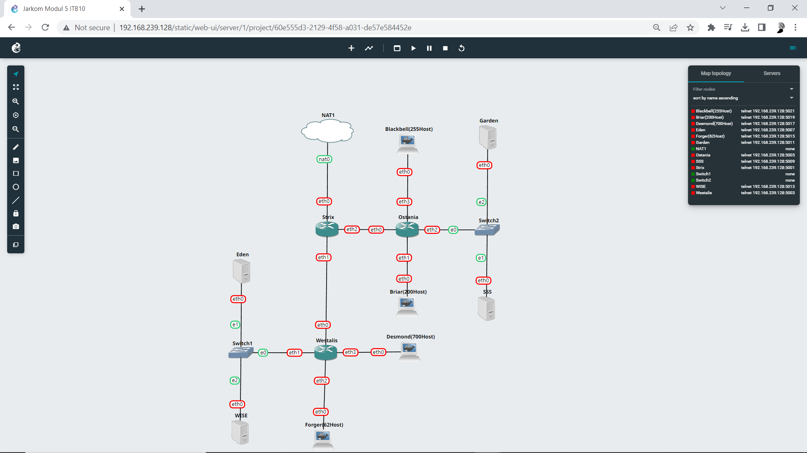
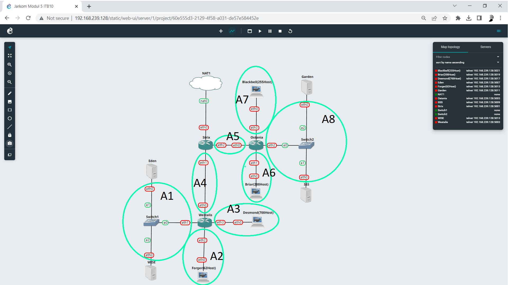
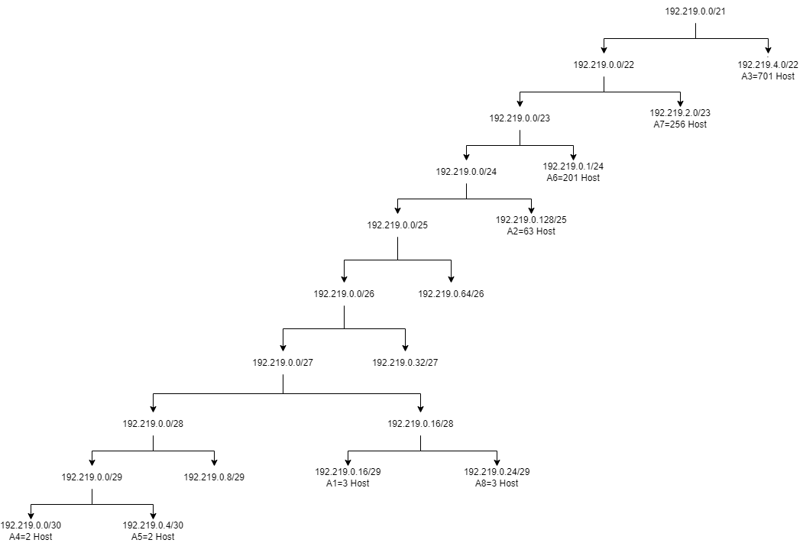

# Jarkom-Modul-5-ITB10-2022
| Nama | NRP |
| --- | --- |
| Jovan Surya Bako | 5027201013 |
| Gde Rio Aryaputra Rahadi | 5027201063 |

Setelah kalian mempelajari semua modul yang telah diberikan, Loid ingin meminta bantuan untuk terakhir kalinya kepada kalian. Dan kalian dengan senang hati mau membantu Loid.

## Soal A
Tugas pertama kalian yaitu membuat topologi jaringan sesuai dengan rancangan yang diberikan Loid.

### Hasil:



Keterangan :	

Eden adalah DNS Server, install bind9 pada Eden:
```
apt-get install bind9 -y
```
WISE adalah DHCP Server, install isc-dhcp-server pada WISE:
```
apt-get install isc-dhcp-server -y
```
Garden dan SSS adalah Web Server, install squid3 pada Garden dan SSS:
```   
apt-get install squid -y
```
Jumlah Host pada Forger adalah 62 host

Jumlah Host pada Desmond adalah 700 host

Jumlah Host pada Blackbell adalah 255 host

Jumlah Host pada Briar adalah 200 host
    
## Soal B
Untuk menjaga perdamaian dunia, Loid ingin meminta kalian untuk membuat topologi tersebut menggunakan teknik CIDR atau VLSM setelah melakukan subnetting.

### Penentuan Subnet:



### VLSM Tree:



### Tabel VLSM Subnetting:

| Subnet  | Jumlah IP | Netmask | Network ID | Subnet Mask | Wildcard | Broadcast Address |
| :---: | :---: | :---: | :---: | :---: | :---: | :---: |
| A1  | 3 | /29 | 192.219.0.16 | 255.255.255.248 |	0.0.0.7	| 192.219.0.23 |
| A2  | 63 | /25 | 192.219.0.128 | 255.255.255.128	| 0.0.0.127	| 192.219.0.255 |
| A3  | 701 | /22 | 192.219.4.0	| 255.255.252.0	| 0.0.3.255	| 192.219.7.255 |
| A4  | 2 | /30 | 192.219.0.0	| 255.255.255.252	| 0.0.0.3	| 192.219.0.3 |
| A5  | 2 | /30 | 192.219.0.4	| 255.255.255.252	| 0.0.0.3	| 192.219.0.7 |
| A6  | 201 | /24 | 192.219.1.0	| 255.255.255.0	| 0.0.0.255	| 192.219.1.255 |
| A7  | 256 | /23 | 192.219.2.0	| 255.255.254.0	| 0.0.1.255	| 192.219.3.255 |
| A8  | 3 | /29 | 192.219.0.24	| 255.255.255.248 |	0.0.0.7	| 192.219.0.31 |
| Total  | 1231 | /21 | 

### Konfigurasi Strix
```
auto eth0
iface eth0 inet dhcp

auto eth1
iface eth1 inet static
        address 192.219.0.1
        netmask 255.255.255.252

auto eth2
iface eth2 inet static
        address 192.219.0.5
        netmask 255.255.255.252
```

### Konfigurasi Ostania
```
auto eth0
iface eth0 inet static
        address 192.219.0.6
        netmask 255.255.255.252
        gateway 192.219.0.5

auto eth1
iface eth1 inet static
        address 192.219.1.1
        netmask 255.255.255.0

auto eth2
iface eth2 inet static
        address 192.219.0.25
        netmask 255.255.255.248

auto eth3
iface eth3 inet static
        address 192.219.2.1
        netmask 255.255.254.0
```

### Konfigurasi Westalis
```
auto eth0
iface eth0 inet static
        address 192.219.0.2
        netmask 255.255.255.252
        gateway 192.219.0.1

auto eth1
iface eth1 inet static
        address 192.219.0.17
        netmask 255.255.255.248

auto eth2
iface eth2 inet static
        address 192.219.0.129
        netmask 255.255.255.128

auto eth3
iface eth3 inet static
        address 192.219.4.1
        netmask 255.255.252.0
```

### Konfigurasi Garden
```
auto eth0
iface eth0 inet static
        address 192.219.0.27
        netmask 255.255.255.248
        gateway 192.219.0.25
```

### Konfigurasi SSS
```
auto eth0
iface eth0 inet static
        address 192.219.0.26
        netmask 255.255.255.248
        gateway 192.219.0.25
```

### Konfigurasi WISE
```
auto eth0
iface eth0 inet static
        address 192.219.0.19
        netmask 255.255.255.248
        gateway 192.219.0.17
```

### Konfigurasi Eden
```
auto eth0
iface eth0 inet static
        address 192.219.0.18
        netmask 255.255.255.248
        gateway 192.219.0.17
```

## Soal C
Anya, putri pertama Loid, juga berpesan kepada anda agar melakukan Routing agar setiap perangkat pada jaringan tersebut dapat terhubung.


### Routing Command Pada Router Strix
```
route add -net 192.219.0.16 netmask 255.255.255.248 gw 192.219.0.2
route add -net 192.219.0.128 netmask 255.255.255.128 gw 192.219.0.2
route add -net 192.219.4.0 netmask 255.255.252.0 gw 192.219.0.2

route add -net 192.219.1.0 netmask 255.255.255.0 gw 192.219.0.6
route add -net 192.219.0.24 netmask 255.255.255.248 gw 192.219.0.6
route add -net 192.219.2.0 netmask 255.255.254.0 gw 192.219.0.6
```
### Routing Command Pada Router Ostania
```
route add -net 0.0.0.0 netmask 0.0.0.0 gw 192.219.0.1
```

### Routing Command Pada Router Westalis
```
route add -net 0.0.0.0 netmask 0.0.0.0 gw 192.219.0.5
```

## Soal D
Tugas berikutnya adalah memberikan ip pada subnet Forger, Desmond, Blackbell, dan Briar secara dinamis menggunakan bantuan DHCP server. Kemudian kalian ingat bahwa kalian harus setting DHCP Relay pada router yang menghubungkannya.

Command instalasi DHCP server pada WISE:
```
echo nameserver 192.168.122.1 > /etc/resolv.conf
apt-get update
apt-get install isc-dhcp-server -y
```

Buka file /etc/default/isc-dhcp-server dan tambahkan eth0 pada INTERFACES
```
INTERFACES="eth0"
```

Buka file /etc/dhcp/dhcpd.conf dan masukkan konfigurasi
```
subnet 192.219.2.0 netmask 255.255.254.0 {
        range 192.219.2.2 192.219.3.254;
        option routers 192.219.2.1;
        option broadcast-address 192.219.3.255;
        option domain-name-servers 192.219.0.18;
        default-lease-time 600;
        max-lease-time 7200;
}

subnet 192.219.1.0 netmask 255.255.255.0 {
        range 192.219.1.2 192.219.1.254;
        option routers 192.219.1.1;
        option broadcast-address 192.219.1.255;
        option domain-name-servers 192.219.0.18;
        default-lease-time 600;
        max-lease-time 7200;
}

subnet 192.219.4.0 netmask 255.255.252.0 {
        range 192.219.4.2 192.219.7.254;
        option routers 192.219.4.1;
        option broadcast-address 192.219.7.255;
        option domain-name-servers 192.219.0.18;
        default-lease-time 600;
        max-lease-time 7200;
}

subnet 192.219.0.128 netmask 255.255.255.128 {
        range 192.219.0.130 192.219.0.254;
        option routers 192.219.0.129;
        option broadcast-address 192.219.0.255;
        option domain-name-servers 192.219.0.18;
        default-lease-time 600;
        max-lease-time 7200;
}

subnet 192.219.0.16 netmask 255.255.255.248 {
        option routers 192.219.0.17;
}
```

Kemudian restart DHCP server
```
service isc-dhcp-server start
```

Router Westalis dan Ostania akan menjadi DHCP Relay

Command instalasi DHCP relay
```
echo nameserver 192.168.122.1 > /etc/resolv.conf
apt-get update
apt-get install isc-dhcp-relay -y
```

Pada saat instalasi akan muncul beberapa pop up, isikan dengan sebagai berikut
```
SERVERS="192.219.0.19"
INTERFACES="eth0 eth1 eth2 eth3"
OPTIONS=""
```

Command instalasi Bind9 pada Eden sebagai DNS server
```
echo nameserver 192.168.122.1 > /etc/resolv.conf
apt-get update
apt-get install bind9 -y
```

Kemudian start DNS server dengan service bind9 start

Konfigurasi DNS Forwarder pada file /etc/bind/named.conf.options di Eden
```
options {
        directory \"/var/cache/bind\";

         forwarders {
                192.168.122.1;
         };

        allow-query{any;};
        auth-nxdomain no;    # conform to RFC1035
        listen-on-v6 { any; };
};
```
Jangan lupa agar node-node client (Blackbell, Briar, Desmond, dan Forger) mendapatkan IP dari DHCP server maka pada konfigurasi dibuat seperti: 
```
auto eth0
iface eth0 inet dhcp
```
